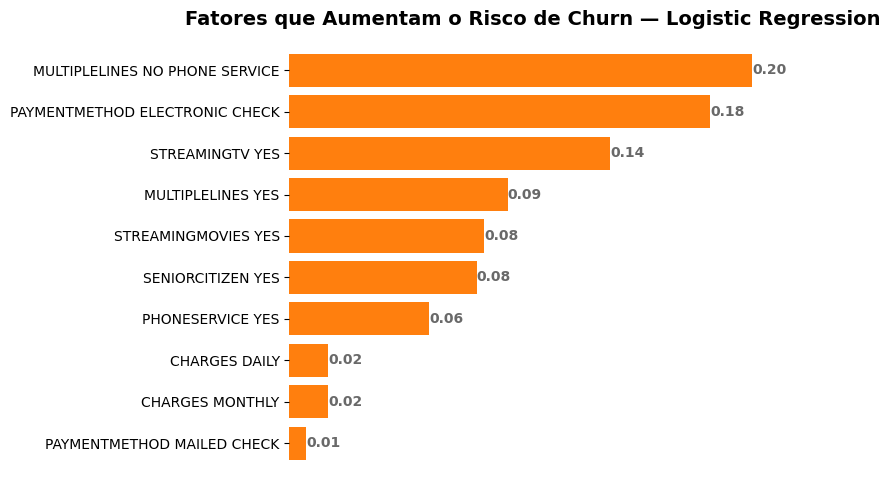

# 📊 Previsão de Churn — Telecom

## 🚀 Visão Geral
Este projeto aplica **Machine Learning** para prever o cancelamento de clientes (**churn**) em uma empresa de telecomunicações.  
Com base em variáveis comportamentais e de perfil, o modelo identifica quais clientes têm maior risco de cancelar, permitindo direcionar **ações de retenção mais eficazes** e reduzir custos.

---

## 🎯 Objetivo
- Prever clientes com risco de cancelamento.  
- Apoiar decisões estratégicas de retenção.  
- Minimizar custos relacionados à perda de clientes.  

---

## 📂 Estrutura do Repositório
```
├── Churn_telecom_x_Part2_final.ipynb   # Notebook principal com toda a análise
├── df_churn.csv                        # Base de dados pré-processada
├── model_LogisticRegression.pkl        # Modelo treinado
└── /view                               # Gráficos e imagens gerados
```

---

## 🛠️ Metodologia
- **Divisão dos dados:** 80% treino / 20% teste.  
- **Pipeline com:**
  - `StandardScaler` → normalização de variáveis numéricas.  
  - `SMOTE` → balanceamento das classes no treino.  
- **Modelos avaliados:**
  - Logistic Regression  
  - K-Nearest Neighbors  
  - Random Forest  
  - Gradient Boosting  
- **Etapas de avaliação:**
  1. Modelo base (sem ajuste).  
  2. Validação cruzada (5-fold).  
  3. Ajuste de hiperparâmetros com **GridSearchCV**.

---

## 📊 Principais Resultados
- **Modelo Final:** Logistic Regression  
- **Motivos da escolha:**
  - Melhor equilíbrio entre **Recall** e **F1-score**.  
  - Menor custo ponderado com base na matriz de confusão, considerando impacto **5x maior** para clientes perdidos.  
  - Consistência nas previsões, evitando excesso de falsos positivos.  

📈 **Exemplo de visualização:** 

![[Comparação de Recall]](view/recall.png) 
  


---

**Programa ONE Next Education | 2025**
